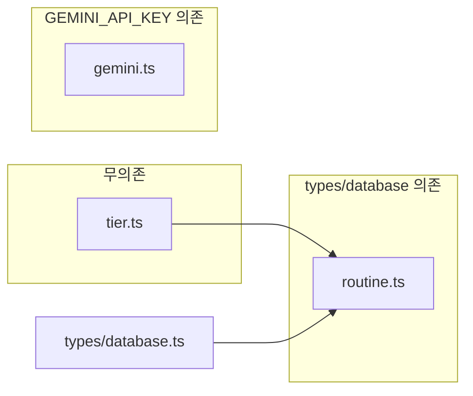

# 1.4 공통 유틸리티 구현 계획

## 전제

- **1.3 환경변수 설정**: 사용자 확인으로 완료. [TODO.md](../TODO.md)에서 1.3 항목은 이미 `[x]` 처리되어 있음. 진행 현황 요약(1. 기본 세팅 완료 수)만 3으로 조정하면 됨.
- **1.4 범위**: [TODO.md](../TODO.md) 85~98행 기준 — `lib/utils/tier.ts`, `lib/utils/routine.ts`, `lib/ai/gemini.ts` 세 모듈.

---

## 1. 구현 순서 및 의존성

- **tier.ts**: 다른 모듈 의존 없음. 온보딩·뱃지·설정에서 먼저 사용.
- **routine.ts**: [types/database.ts](../../types/database.ts)의 `RoutineBlock` 타입 사용. 루틴 빌더·플레이어에서 TUT/소요시간/세트 수 계산.
- **gemini.ts**: `GEMINI_API_KEY` 환경변수 사용. 4.2 AI 코치의 `generateRoutine(context)` Server Action에서 호출.

권장 구현 순서: **tier → routine → gemini**.

---

## 2. 모듈별 상세 계획

### 2.1 `lib/utils/tier.ts` — 티어 유틸리티

| 항목 | 내용 |
|------|------|
| **입출력** | `profiles.current_tier`(1~6) 및 UI 표시명·색상 |
| **참조** | [TODO.md](../TODO.md) 160~167행 티어 테이블 |

**구현 내용**

- **티어 번호 ↔ 이름**
  - 상수: `TIER_NAMES`: `1 → 'Silver'`, `2 → 'Gold'`, `3 → 'Platinum'`, `4 → 'Diamond'`, `5 → 'Master'`, `6 → 'Grandmaster'`.
  - 함수: `getTierName(level: number): string | null`, `getTierLevel(name: string): number | null`.
- **티어별 색상 코드**
  - 기본 색상(UI 뱃지·차트용): `TIER_COLORS` 또는 `getTierColor(level: number): string`.
  - 실제 암장별 색상은 `gym_grade_scales` 사용. 여기서는 fallback/기본 팔레트만 제공.
- **타입**
  - `TierLevel`(1|2|3|4|5|6) 등 필요 시 [database.types.ts](../../database.types.ts)의 `current_tier` 제약과 맞춤.

**파일**: [lib/utils/tier.ts](../../lib/utils/tier.ts) 신규 생성. 기존 [lib/utils.ts](../../lib/utils.ts)(`cn`)는 유지.

---

### 2.2 `lib/utils/routine.ts` — 루틴 계산 유틸리티

| 항목 | 내용 |
|------|------|
| **입력** | `structure_json` (타입: [types/database.ts](../../types/database.ts)의 `RoutineBlock[]`) |
| **참조** | [PRD.md](../PRD.md) 3.2 B Custom Builder, [TODO.md](../TODO.md) 303~306행(통계: 운동 수, 세트, TUT, 소요시간) |

**구현 내용**

- **TUT (Time Under Tension) 계산**
  - 블록 구조를 순회하며 "긴장 시간"(운동 구간 초 단위) 합산.
  - `RoutineBlock`에 `durationSeconds` 또는 유사 필드 가정; 구조가 정해지기 전까지는 placeholder/추상 함수로 두고, RB-03 에디터 스펙 확정 시 실제 필드명 반영.
- **총 소요시간 계산**
  - `structure_json` 기준 예상 소요시간(초) 반환. 운동+휴식 등 모든 블록 duration 합.
  - 함수 예: `getRoutineTotalDurationSeconds(structure: RoutineBlock[]): number`.
- **총 세트 수 계산**
  - 그룹/루프 블록의 반복 횟수까지 반영한 "세트" 수.
  - 함수 예: `getRoutineTotalSets(structure: RoutineBlock[]): number`.
- **재사용성**
  - 루틴 빌더 푸터(EditorFooter), 루틴 카드, 플레이어 등에서 동일 함수 사용.
  - [database.types.ts](../../database.types.ts)의 `routines.estimated_time`, `routines.total_sets`는 서버 저장용; 이 유틸은 클라이언트/서버 공용 "구조 → 통계" 계산용.

**파일**: [lib/utils/routine.ts](../../lib/utils/routine.ts) 신규 생성. `RoutineBlock` import from `@/types/database` 또는 상대 경로.

**주의**: 현재 `RoutineBlock`은 `type`, `children?`, `[key: string]: unknown` 수준. RB-03에서 블록 스키마(duration, repeat 등)가 확정되면 `routine.ts` 시그니처와 내부 로직을 한 번 더 맞출 필요 있음.

---

### 2.3 `lib/ai/gemini.ts` — Gemini API 클라이언트

| 항목 | 내용 |
|------|------|
| **역할** | 루틴 생성 AI 호출, 프롬프트·스키마 고정 |
| **참조** | [PRD.md](../PRD.md) 3.2 A Context Injection, [TODO.md](../TODO.md) 4.2 RB-02 `generateRoutine(context)` |

**구현 내용**

- **API 클라이언트 초기화**
  - `GEMINI_API_KEY` 사용. 패키지: `@google/generative-ai` (공식 SDK) 또는 `fetch` 직접 호출.
  - 서버 전용이므로 [lib/ai/gemini.ts](../../lib/ai/gemini.ts)에서만 사용하고, 키는 서버 환경변수로만 접근.
- **프롬프트 템플릿**
  - Context: 티어, 체중, 지난 훈련 로그(요약).
  - 템플릿 함수 예: `buildRoutinePrompt(context: { tier?: number; weightKg?: number; recentSummary?: string }): string`.
- **Strict JSON Schema 검증**
  - Gemini 응답을 "루틴 JSON"으로 기대하고, 스키마(예: `RoutineBlock[]` 또는 정해진 루틴 DTO)로 검증.
  - 라이브러리: `zod`(이미 의존성 있음)로 파싱·검증 후 타입 안전하게 반환.
- **에러 처리**
  - 키 누락, API 오류, 파싱 실패 시 명시적 에러 메시지 또는 throw.
  - [actions/ai.ts](../../actions/ai.ts)에서 `generateRoutine`이 이 모듈을 호출한다고 가정.

**파일**: [lib/ai/gemini.ts](../../lib/ai/gemini.ts) 신규 생성. `lib/ai/` 디렉토리 없으면 생성.

**의존성**: `@google/generative-ai` 추가 여부는 구현 시 선택. 없으면 `fetch`로 REST 호출 가능.

---

## 3. TODO.md 반영 사항

- **1.3**: 이미 체크됨. "진행 현황 요약"에서 1. 기본 세팅 **완료 수를 3**으로 변경(1.1, 1.2, 1.3 완료).
- **1.4**: 구현 후 각 하위 항목(tier.ts 3개, routine.ts 3개, gemini.ts 3개)을 `[x]` 처리.

선택: 1.4 하단에 "1.4 공통 유틸리티 — 구현계획" 접이식 표를 추가해, 위 순서·의존성·주의사항을 요약해 두면 이후 구현·리뷰 시 참고하기 좋음.

---

## 4. 검증 방법

| 모듈 | 검증 |
|------|------|
| tier | 단위 테스트 또는 간단 스크립트: `getTierName(1) === 'Silver'`, `getTierLevel('Gold') === 2`, `getTierColor(1)` 반환값 확인. |
| routine | `RoutineBlock[]` fixture로 `getRoutineTotalDurationSeconds`, `getRoutineTotalSets`, TUT 합계 호출 후 기대값과 비교. (블록 스키마 확정 후 fixture 보강) |
| gemini | 서버에서만 호출: `GEMINI_API_KEY` 설정 후 `buildRoutinePrompt` + 실제 호출(또는 모킹)으로 JSON 응답 및 zod 검증까지 확인. |

---

## 5. 요약 체크리스트

- 1.3 완료 반영: 진행 현황 요약 1. 기본 세팅 완료 = 3, 진행률 30%.
- 1.4 구현 순서: tier.ts → routine.ts → gemini.ts.
- tier.ts: 티어 이름·번호·기본 색상, 타입 정리.
- routine.ts: TUT/총 소요시간/총 세트 수, `RoutineBlock[]` 기반; 스키마 확정 후 보강.
- gemini.ts: 클라이언트 초기화, 프롬프트 템플릿, JSON(zod) 검증, 서버 전용.
- 구현 후 TODO.md 1.4 하위 체크 및 (선택) 구현계획 접이식 추가.
